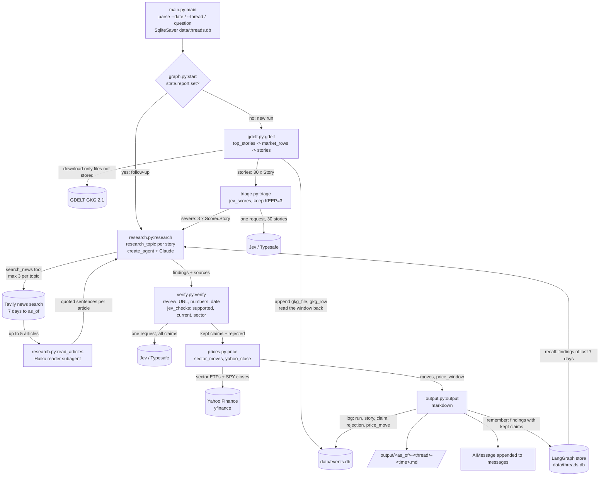

# How it works

Written from the code on branch `simplify-graph` on 2026-10-02. Every claim cites a file. Where the code does not say something, this document says so.

## 1. Summary

This project is a command-line program that looks at the last 6 hours of world news and tells you which market-related stories might matter economically and what news articles say about them. It downloads article metadata from GDELT (a free feed that lists news articles every 15 minutes), groups the articles into stories, and ranks them by how many websites published them (`gdelt.py`). An external scoring service called Jev (from Typesafe) rates how economically severe each story is, and the 3 highest are kept (`triage.py`). For each of those 3, a Claude agent searches recent news with Tavily, a smaller Claude Haiku subagent copies out the sentences about each search, and the agent writes short factual claims, each tied to an article URL (`research.py`). Plain code and Jev then remove claims that cannot be tied to their article (`verify.py`), Yahoo Finance prices show how the affected stock sectors moved (`prices.py`), and the result is written as a Markdown file in `output/` (`output.py`). Every GDELT file fetched and every run's results are appended to a SQLite database, `data/events.db` (`db.py`), and each report's findings are remembered for the next week's reports (`research.py:recall`). You can later ask a follow-up question in the same run, which is researched, checked and written up the same way (`graph.py:start`).

## 2. Run flow, step by step

The graph is defined in `graph.py:build` as six nodes in a straight line: `gdelt -> triage -> research -> verify -> price -> output`. All nodes read and write one shared object, `state.py:State`. A node returns a dict of the fields it changed and LangGraph merges it into the state.

### Step 0. Start the program

- What happens: `main.py` loads `.env`, parses `--date`, `--thread` and an optional question, picks a thread ID (new random 8-character hex, or the one given), creates `data/` if missing, opens `data/threads.db` as both the checkpointer and the LangGraph store (`SqliteStore`), compiles the graph with them and streams it. After each node it prints the changed fields.
- Code: `main.py:main`, `main.py:describe`, `graph.py:build`.
- In: command-line arguments. New run: `{"as_of": "2026-09-30"}` or `{"as_of": None}`. Follow-up: `{"messages": [{"role": "user", "content": question}]}` (`main.py:48`).
- Out: a running graph. The thread's state is saved to `data/threads.db` after every node.

### Step 1. Route: new run or follow-up

- What happens: if the thread already has a `report` (an earlier run finished), go straight to research. Otherwise start at gdelt.
- Code: `graph.py:start`.
- In: `State`. Out: the string `"gdelt"` or `"research"`.

### Step 2. Download GDELT and pick stories (no LLM)

- What happens: reads `lastupdate.txt` from GDELT to find the newest 15-minute update. The window ends at that update, or at 23:45 UTC on `--date` if that is earlier. It downloads the 24 GKG (Global Knowledge Graph) files that make up the 6 hours before that end, 8 at a time, and skips any GDELT did not publish (HTTP 404). It first asks `data/events.db` which of the 24 files it already has (table `gkg_file`) and downloads only the others. From each downloaded file it keeps rows tagged with one of 13 market themes (`gdelt.py:MARKET_THEMES`, e.g. `ECON_OILPRICE`) that have a page title, parses them (`gdelt.py:record`), and appends them to `gkg_row` keyed by GDELT's `GKGRECORDID`, skipping IDs already stored. The file and its rows are written in one transaction, and a file GDELT skipped is stored with `rows = 0`. Then it reads the window's rows back with one `SELECT`. A run 15 minutes after another downloads 1 file instead of 24. Tested: a second run on the same day downloaded none.
- Code: `gdelt.py:gdelt` -> `gdelt.py:top_stories` (opens the DB via `db.py:connect`) -> `gdelt.py:market_rows` (download missing files, append, read window), `gdelt.py:record`, `gdelt.py:http_get`, `gdelt.py:themes`.
- In: `as_of` (YYYY-MM-DD or None). Out: `as_of` (filled in with the end date if it was None) and the window's rows as `(site, url, title, themes, actors, places)` tuples, newest file first.
- Error: a `--date` after the newest GDELT update raises `ValueError` (`gdelt.py:64`). Any other HTTP error raises from `httpx` (`gdelt.py:41`). Both stop the run.

### Step 3. Group rows into stories (no LLM)

- What happens: rows are grouped by page title (case-insensitive). For each title the code counts articles and distinct sites and collects people, organizations, themes and places. Stories are ranked by number of distinct sites, then number of articles, then title, and the top 30 are kept. This is the only ranking before Jev. There is no severity score here.
- Code: `gdelt.py:stories`.
- In: the row tuples from step 2. Out: `stories: list[Story]` (30 at most). `Story` = url, title, articles, sites, actors (up to 8), themes, places (up to 5) (`state.py:Story`).

### Step 4. Score severity and keep 3 (Jev, no Claude)

- What happens: all 30 stories go to Jev in one request. Jev reads each story's title plus a one-line summary built from GDELT metadata (`triage.py:describe`), not the article text, and scores it on a 4-step rubric (`triage.py:RUBRIC`, 0 minor to 3 severe). The stories are sorted by score and the top `KEEP = 3` are kept.
- The threshold: there is no minimum score. It always keeps exactly the 3 highest. The docstring explains why: on 30 Sep 2026 the highest of 100 stories scored 1.07, so any floor at 1.0 or 2.0 left nothing (`triage.py:5-7`).
- Fallback: without `TYPESAFE_API_KEY`, or if the Jev call raises, it keeps the first 3 stories from step 3 (the most widely published), with `severity=None`, and says so in `jev_status`.
- Code: `triage.py:triage`, `triage.py:jev_scores`, `triage.py:describe`.
- In: `stories: list[Story]`. Out: `severe: list[ScoredStory]` (3 items, each a `Story` plus `severity` and `confidence`) and `jev_status: str`.

### Step 5. Research each story (the only Claude agent; this is where Tavily is called)

- What happens: one topic string per severe story is built from its title, GDELT URL, actors and places. On a follow-up, there is one topic instead: the latest user message plus the topics of earlier findings. For each topic a fresh agent is created with `langchain.agents.create_agent`, using Claude, the system prompt `research.py:PROMPT`, one tool `search_news`, and `response_format=Finding`, so the agent must end by returning a `Finding` object.
- When Tavily is called: only when Claude calls the `search_news` tool. Each call runs one Tavily news search, 5 results, limited to the 7 days ending on `as_of` (`research.py:107-109`). Results with a known publication date after `as_of` are dropped. The tool counts calls per topic and returns "Search limit reached" after 3 (`MAX_SEARCHES`). So a full run makes at most 9 Tavily calls (3 topics x 3).
- Every article the tool returns is stored in a `sources` dict by URL (title, published date as YYYY-MM-DD or "unknown", first 1500 characters of content). These are the only articles a claim may cite later.
- Reader subagent: before returning, `search_news` passes the articles to `research.py:read_articles`, a Claude Haiku agent (`READER`, `READER_PROMPT`, `response_format=Notes`). It returns, per article about the query, the sentences that answer it, copied word for word. Articles it leaves out are not shown to the research agent, but stay in `sources`. If the reader raises, the tool shows the full excerpts instead (`research.py:120-123`). Verify still checks numbers against the full 1500-character excerpt, not the quotes.
- Memory: on a new report, `research.py:recall` reads the findings earlier reports stored in the LangGraph store for the 7 days ending `as_of` (`MEMORY_DAYS`) and appends them to every topic as "Earlier reports (context only, do not cite)". Prompt rule 5 tells Claude to use them only to see how the story developed. Claims still come only from `search_news`, and verify still rejects any other URL. There is no memory on follow-ups or when the graph has no store.
- Code: `research.py:research`, `research.py:research_topic`, inner tool `search_news`, `research.py:read_articles`, `research.py:recall`, `research.py:published_day`.
- In: `severe`, `as_of`, the store (`runtime.store`), and on follow-up `messages[-1]` and `findings`. Out: `findings: list[Finding]` (one per topic; `Finding` = topic, summary, claims) and `sources: list[Source]`. `Claim` = text, source_url, source_date, sector (empty), unverified (False) (`state.py:Claim`).

### Step 6. Verify claims (code checks, then Jev)

- What happens, in this order for each claim (`verify.py:review`):
  1. Code: if the claim's URL is not one of the `sources` from step 5, remove it.
  2. Code: if any number in the claim is missing from that source's title plus excerpt, remove it. Numbers are compared after stripping thousands separators (`verify.py:numbers`).
  3. Code: replace the claim's `source_date` with the date the tool recorded, so the model's date is never used.
  4. Jev (one request for all claims, `verify.py:jev_checks`): three questions per claim. `supported`: does the source say this. `current`: is it about the 7 days ending `as_of`. `sector`: which of 11 US sectors (or "none") it most directly affects.
  5. Thresholds (`verify.py:20`): `supported` or `current` below `DOUBT = 0.4` removes the claim. Below `SURE = 0.7` keeps it but sets `unverified=True`. The sector is set only if Jev's sector confidence is at least `SECTOR_SURE = 0.75` and the answer is not "none".
- Fallback: without `TYPESAFE_API_KEY`, or if Jev raises, only checks 1-3 run, claims get no sector, and `verify_status` says so. With no sectors, step 7 does nothing.
- Code: `verify.py:verify`, `verify.py:review`, `verify.py:jev_checks`, `verify.py:numbers`.
- In: `findings`, `sources`, `as_of`. Out: `findings` with only kept claims, `rejected: list[str]` (each removed claim and the reason), `verify_status: str`.
- Not checked: the finding's `summary` text is written by Claude and is not verified.

### Step 7. Market prices (yfinance; no FRED)

- What happens: collects the distinct sectors on kept claims. If there are none, it returns empty and skips the download. Otherwise it maps each sector to its SPDR ETF (`prices.py:SECTOR_ETFS`, e.g. energy -> XLE), downloads adjusted daily closes for those ETFs and SPY from Yahoo Finance for the 10 days before `as_of`, and compares the last two closes. Today is excluded because the session may still be open (`prices.py:34`, end date is `min(as_of + 1 day, today)` and exclusive). Each move is reported as a percent and as points above or below SPY.
- FRED: not used anywhere. No file imports a FRED client and `pyproject.toml` lists no FRED package. Only yfinance is used.
- Fallback: any download error, or fewer than 2 closes, gives no moves and a `price_window` line saying prices are unavailable. The run continues.
- Code: `prices.py:price`, `prices.py:sector_moves`, `prices.py:yahoo_close`.
- In: `findings`, `as_of`. Out: `moves: dict[sector, (move %, vs SPY pts)]` and `price_window: str`.

### Step 8. Write outputs (no LLM)

- What happens: builds a Markdown report: header, Jev status (new runs only), verify status, one section per finding with Jev severity and GDELT counts, the kept claims with source links, dates, sector and an "Unverified" flag, a market reaction table, and the list of removed claims. Writes it to `output/<as_of>-<thread_id>-<HHMMSS>.md`. The Markdown is also appended to `messages` as the AI reply.
- Run log: `output.py:log` appends the run to `data/events.db`: one `run` row (kind `events` or `followup`), the kept `story` rows (new reports only), kept `claim` rows, `rejection` rows and `price_move` rows. Each table has a natural key and uses `ON CONFLICT DO NOTHING`, so nothing is ever overwritten.
- Memory: on a new report, `research.py:remember` stores each finding that has kept claims in the LangGraph store under `("findings", as_of)`, for later reports to recall (step 5). Findings are stored after verify, so only verified claims are kept.
- Code: `output.py:output`, `output.py:markdown`, `output.py:log`, `research.py:remember`.
- In: the whole `State` and the store. Out: `report: str` (the .md path) and one `AIMessage`. Files in `output/`, rows in `data/events.db`, store items in `data/threads.db`.

### Step 9. Follow-up run

- `uv run main.py --thread ID "question"` loads that thread's state from `data/threads.db`. `report` is set, so `graph.py:start` sends it to research (step 5) with the question as the only topic, then verify, price and output again. `findings`, `sources`, `rejected`, `moves` are replaced. `severe` and `jev_status` are left from the first run and not printed (`output.py:28-29`).

## 3. Diagram

## 4. Agents

### What is agentic and what is fixed

| Part | Who decides | File |
|---|---|---|
| Which GDELT files, which rows, which 30 stories | Code | `gdelt.py` |
| Severity scores | Jev (external service, called with a fixed question per story) | `triage.py:jev_scores` |
| Which 3 stories get researched | Code (sort by Jev score, take 3) | `triage.py:58-59` |
| How many searches (0 to 3), what to search for, which articles to cite, claim wording, summary, topic name | Claude, inside the research agent | `research.py:research_topic` |
| Which returned articles are about the search, which sentences to show | Claude Haiku, the reader subagent | `research.py:read_articles` |
| Search date window, result count, 3-search cap, dropping future-dated articles | Code, inside the tool | `research.py:search_news` |
| Claim removed for bad URL or numbers; source date | Code | `verify.py:review` |
| Claim supported, current, sector | Jev, then code applies thresholds | `verify.py:jev_checks`, `verify.py:review` |
| Prices and report | Code | `prices.py`, `output.py` |
| Graph order and follow-up routing | Code | `graph.py` |

The graph itself is fixed. There is no LLM router or supervisor. Claude only chooses things inside one research topic, and Haiku only chooses what to quote from one search's articles. Jev is called with fixed questions and its answers are used by code. Whether Jev uses an LLM internally is not visible in this repo.

### The main agent

- The main agent is the research agent (`research.py:127`). It is created fresh for every topic, so up to 3 per new run and 1 per follow-up. Each one starts with an empty context.
- Model: `RESEARCH_MODEL` env var, default `anthropic:claude-sonnet-5-5`, created once at import with `timeout=120`, `max_tokens=8000` (`research.py:27`).
- System prompt: `research.py:PROMPT` (`research.py:32-43`).
- Tools: one, `search_news(query: str) -> str` (`research.py:101`).
- Output: `response_format=Finding`, so the agent's final answer is parsed into `state.py:Finding` and read from `result["structured_response"]` (`research.py:130`).
- Limits: 3 searches per topic (tool counter), `recursion_limit=20` graph steps per agent run (`research.py:129`).

### Subagents and tools

- `search_news`: Tavily news search. Triggered only when Claude calls it. Returns plain text, one block per article about the query with title, url, published date and the reader's quoted sentences. Other replies: "No articles found.", "No articles about this query.", or "Search limit reached. Answer with what you have." after 3 calls. As a side effect it records each article in `sources` for verify.
- Reader subagent, `research.py:read_articles`: one per `search_news` call that found articles, so at most 9 per run. Model `anthropic:claude-haiku-4-5-20251001`, timeout 60 s, max 4000 tokens (`research.py:30`). Prompt `research.py:READER_PROMPT`. No tools. Returns `Notes`, a list of `Reading(article, sentences)`. Code drops readings with an out-of-range article number or no sentences. Code calls it inside the tool. The research agent does not choose to call it.
- Jev is not a tool of the agent. It is called directly by `triage.py` and `verify.py`.

### LangSmith

- Tracing is turned on by environment variables only (`LANGSMITH_TRACING`, `LANGSMITH_API_KEY`, `LANGSMITH_PROJECT` in `.env.example`). No code in the repo calls the LangSmith SDK directly.
- One `main.py` invocation is one trace named "Event graph" (`main.py:49`). Inside it, each node (gdelt, triage, research, verify, price, output) is a child run. Inside research, each topic is a child run named `research: <first 60 chars of topic>` (`research.py:129`), and under that come the Claude calls and each `search_news` tool call with its query and returned text. Inside each `search_news` call is a child run named `reader: <first 60 chars of query>` with the Haiku call and its `Notes` output.
- Jev, Tavily HTTP and yfinance are not traced as separate LLM runs. Jev and yfinance show only as part of their node's run. The Tavily call shows as the `search_news` tool run.
- Threads: `main.py` puts `thread_id` in `configurable`. `langchain_core` copies string `configurable` values into tracing metadata (`langchain_core/runnables/config.py:155-168`), so every trace has `thread_id` metadata and LangSmith groups the first run and its follow-ups as one thread. `main.py` also adds `metadata={"thread": thread}`, which is the same value under a second key.
- Studio: `uv run langgraph dev` serves `graph.py:graph` (configured in `langgraph.json`), compiled without a checkpointer or store. The dev server supplies both, so Studio threads and Studio's findings memory are separate from `data/threads.db` (`graph.py:7-8`). Not tested with the new store.

## 5. Module map

| File | Responsible for | Key functions | Called by |
|---|---|---|---|
| `main.py` | CLI, thread ID, SQLite checkpointer and store, printing node updates | `main`, `describe` | user (`uv run main.py`) |
| `graph.py` | Graph wiring and follow-up routing; `graph` for Studio | `build`, `start`, `graph` | `main.py`, `langgraph.json` |
| `state.py` | State and data models; checkpoint allow-list | `State`, `Story`, `ScoredStory`, `Claim`, `Finding`, `Source`, `CHECKPOINT_TYPES` | every node, `main.py` |
| `gdelt.py` | GDELT download of missing files, market-theme filter, append to events.db, story ranking | `gdelt`, `top_stories`, `market_rows`, `record`, `stories`, `themes`, `http_get`, `unzip` | `graph.py` |
| `db.py` | `data/events.db` schema and connection. Append-only tables: `gkg_file`, `gkg_row`, `run`, `story`, `claim`, `rejection`, `price_move` | `connect`, `SCHEMA`, `PATH` | `gdelt.py`, `output.py` |
| `triage.py` | Jev severity scores, keep 3 | `triage`, `jev_scores`, `describe` | `graph.py` |
| `research.py` | Claude agent with Tavily search tool and Haiku reader subagent, findings memory | `research`, `research_topic`, `search_news`, `read_articles`, `recall`, `remember`, `published_day` | `graph.py`, `output.py` (imports `remember`) |
| `verify.py` | Claim checks by code and Jev, sector tagging | `verify`, `review`, `jev_checks`, `numbers` | `graph.py` |
| `prices.py` | Sector ETF moves vs SPY from Yahoo Finance | `price`, `sector_moves`, `yahoo_close`, `SECTOR_ETFS` | `graph.py`, `output.py` (imports `SECTOR_ETFS`) |
| `output.py` | Markdown report, reply message, run log, storing findings | `output`, `markdown`, `log` | `graph.py` |
| `tests/test_nodes.py` | 14 tests for gdelt (including the 15-minute overlap), triage, verify, price, output (including the run log and memory), routing, the reader's filtering and recall. No network, GDELT/Jev/yfinance/reader stubbed, each test uses its own temporary DB. The research agent loop is not tested | - | `uv run pytest` (14 passed on 2026-10-02) |
| `langgraph.json` | Tells `langgraph dev` where the graph and `.env` are | - | `langgraph dev` |
| `.github/workflows/openwiki-update.yml` | Daily job that regenerates `openwiki/` docs. Not part of the run | - | GitHub Actions |

Flags:

- Wrong help text: `main.py:4` and `main.py:42` say the default is "the latest 24 hours". `gdelt.py` reads 6 hours (`UPDATES = 24` files of 15 minutes).
- Duplicate metadata: `main.py:49` sets `metadata={"thread": thread}`, while `thread_id` already reaches trace metadata from `configurable`.
- `ScoredStory.confidence` is written by triage, but nothing reads it.
- Unused `.env` keys: the local `.env` also sets `MODEL`, `STRONG_MODEL` and `EVENT_TIMEZONE`. No code reads them.
- No dead modules: every `.py` file is reached from `main.py` or `graph.py`.

## 6. Config and secrets

| Name | Read at | Required | If missing |
|---|---|---|---|
| `ANTHROPIC_API_KEY` | By `langchain_anthropic` when research calls Claude (`research.py:27` and `research.py:30` build `MODEL` and `READER`) | Yes | Import works. The run fails at the first Claude call in research. Nodes before it already ran and are saved in `data/threads.db`. No report is written |
| `TAVILY_API_KEY` | `research.py:107` via `os.environ[...]` | Yes | Line missing from `.env`: `KeyError` when Claude first calls `search_news`, and the run stops in research (tested). Line present but empty: tavily-python 0.8.4 still answered searches in a test on 2026-10-02, with undocumented limits |
| `TYPESAFE_API_KEY` | `triage.py:50`, `verify.py:84` via `os.getenv`. Also read by `TypeSafeClient` | No | Triage keeps the 3 most widely published stories with no score. Verify runs only URL, number and date checks, sets no sectors, so price shows nothing. Both statuses say so in the report |
| `RESEARCH_MODEL` | `research.py:27` at import | No | Uses `anthropic:claude-sonnet-5-5`. The reader model is fixed in code, with no env var |
| `LANGSMITH_TRACING`, `LANGSMITH_API_KEY`, `LANGSMITH_PROJECT` | By the `langsmith` library, not by repo code | No | No traces. With tracing on and no key, LangSmith logs upload errors and the run continues (library behavior, not tested here) |
| `.env` file | `main.py:22` (`load_dotenv`), `langgraph.json` `"env"` for Studio | - | Keys must then come from the shell environment |
| `data/` folder | `main.py:50`, `db.py:connect` | - | Created if missing |

Constants in code (no env var):

| Constant | Value | File |
|---|---|---|
| `UPDATES` | 24 files = 6 hours | `gdelt.py:25` |
| `TOP_STORIES` | 30 | `gdelt.py:27` |
| `MARKET_THEMES` | 13 GKG themes | `gdelt.py:28` |
| GDELT URLs | `data.gdeltproject.org/gdeltv2/...` | `gdelt.py:23-24` |
| Database file | `data/events.db` | `db.py:PATH` |
| `MEMORY_DAYS` | 7 days of earlier findings | `research.py:29` |
| `KEEP` | 3 stories | `triage.py:17` |
| `RUBRIC` | 4 severity levels | `triage.py:19` |
| Jev timeout | 90 s | `triage.py:41`, `verify.py:54` |
| `MAX_SEARCHES` | 3 per topic | `research.py:28` |
| Tavily | `topic="news"`, 5 results, 7-day window | `research.py:107-109` |
| Excerpt length | 1500 characters | `research.py:116` |
| Agent `recursion_limit` | 20 | `research.py:129` |
| `READER` | `claude-haiku-4-5-20251001`, 60 s, 4000 tokens | `research.py:30` |
| `SURE`, `DOUBT`, `SECTOR_SURE` | 0.7, 0.4, 0.75 | `verify.py:20` |
| `SECTORS` | 11 sectors plus "none" | `verify.py:21` |
| `SECTOR_ETFS` | 11 SPDR ETFs | `prices.py:16` |
| Report folder | `output/` | `output.py:23` |
