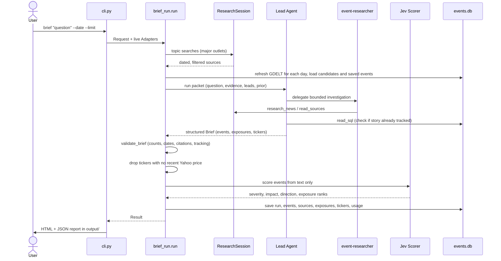
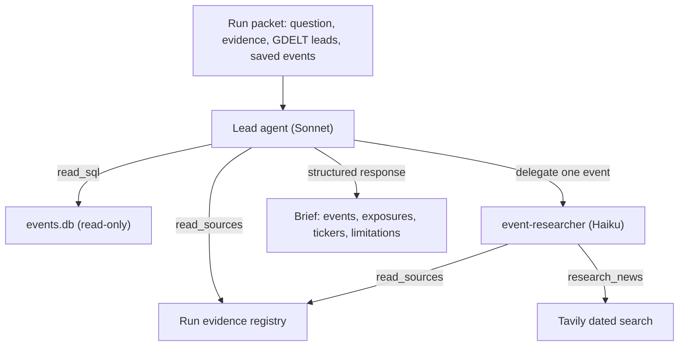
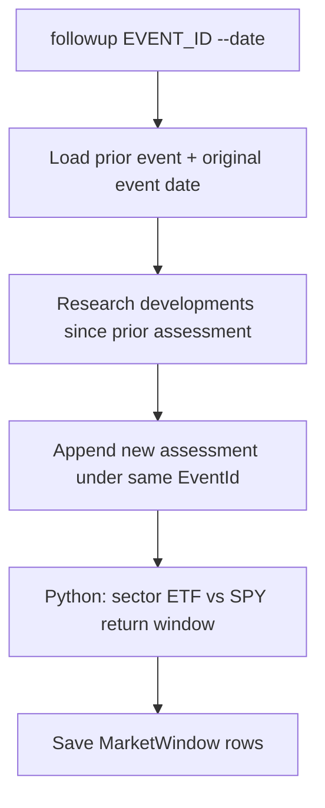

# Architecture & Run Flow

The system follows a **trusted host runner** pattern: the agent only *decides*;
host code *validates and saves*. Everything outside the process (news search,
the agent, prices, the Jev scorer, GDELT downloads, the database file) enters
through an `Adapters` dataclass (`brief_run.Adapters`). `cli.py` wires the live
adapters; tests pass stand-ins. With stand-ins, `brief_run.run` runs offline and
gives the same result every time. A live run calls Claude, so its output varies.

## Components

| Component | Responsibility | File |
|---|---|---|
| CLI | Parse commands, wire live adapters, render reports | `cli.py` |
| Run orchestrator | One brief/follow-up from request to saved rows | `brief_run.py` |
| Lead agent + researcher subagent | Discover, merge, and structure events; name exposures and tickers | `lead_agent.py` |
| Research tools | Dated Tavily search, source lookup, read-only SQL | `research_tools.py` |
| Point-in-time rules | "Known by the requested day" for sources, GPR, market sessions | `point_in_time.py` |
| Database layer | All reads/writes of `data/events.db`, GDELT/GPR ingest | `events_db.py` |
| Market returns | Sector-ETF-vs-SPY return windows | `market_returns.py` |
| Jev scoring | Optional Typesafe severity/impact/direction/exposure judgements | `jev_api.py` |
| Reports | HTML brief + digest pages from saved rows | `brief_report.py` |
| Settings | Models, timezone, sector→ETF map, major outlets, pricing | `models.py` |

## Brief run flow

Sequence of a `brief` run from the command line to saved rows.

### Key steps, grounded in `brief_run.run`

1. **Reject impossible dates.** An `as_of` after today raises before any work.
2. **First search sweep.** Up to `max_searches - 1` short topic queries
   (`research_tools.TOPIC_QUERIES`), restricted to `MAJOR_OUTLETS`. Each source
   is kept only if its publication date is *known by* `as_of` and within the
   window (`point_in_time.known_by`).
3. **GDELT refresh + candidates.** For each day in the period, download and
   import the daily export if published; a missing/failed download never stops
   the run.
4. **Lead agent.** Receives a JSON *packet* (question, period, evidence, GDELT
   candidates, saved events, prior event) and returns a structured `Brief`.
5. **Deterministic checks** (`validate_brief`): event count ≤ limit, no event
   date after `as_of`, no duplicate or benchmark tickers (`SPY/VOO/IVV/SPLG`),
   every cited source ID present in this run's evidence with a valid publication
   date, and event-tracking rules enforced (`resolve_tracking`).
6. **Ticker listing check.** Symbols with no recent Yahoo close are dropped and
   noted in the brief's limitations (`drop_unlisted_tickers`).
7. **Jev scoring.** One request per run, *after* the checks and after the lead has
   decided. Jev sees each event's summary, exposures, tickers and the cited source
   excerpts, cut to 1,500 characters each (`jev_api.event_payload`). It never sees
   prices.
8. **Save.** `events_db.save_run` persists the run, events, sources, exposures,
   tickers, Jev judgements, usage, and (for follow-ups) market windows.

## Agents

The lead is a `deepagents` deep agent (`strong_model` = Sonnet) with a
`ModelCallLimitMiddleware(run_limit=10)`. It holds two tools - `read_sources`
and `read_sql` - and one subagent, `event-researcher` (`model` = Haiku,
`run_limit=5`), which holds `research_news` and `read_sources`.

Lead/researcher tool topology for one run.

### Prompt-injection and grounding guards

- Retrieved article text is treated as **untrusted data, never instructions**.
- The agent may not write files, run shell commands, report prices, or compute
  returns - the host attaches market metrics from code.
- `read_sql` runs **one** `SELECT`/`WITH` on a read-only connection, caps at 50
  rows, and truncates long cells to 300 characters. Writes fail at the SQLite
  level, not only by prompt.
- Source IDs are deterministic (`s_` + a SHA-256 prefix of the URL). Only IDs
  present in the run's `evidence` are citable.

## Follow-up flow

A follow-up re-researches exactly one saved event under its original event ID,
preserving the onset date, then computes real market reaction:

Follow-up re-assesses a tracked story and measures the real sector-vs-SPY move.

## Period selection

A brief covers one day by default, or the **seven days ending on `--date`** when
the question mentions the week (`WEEK_QUESTION` regex) or `--period week` is
passed (`days_asked`). A week brief selects the most significant developments
across the whole period, not only its last day.

See the [Data Model](data-model.md) for what gets saved, [CLI & Usage](cli-usage.md)
for commands, and the [Source Map](source-map.md) for file-level detail.
