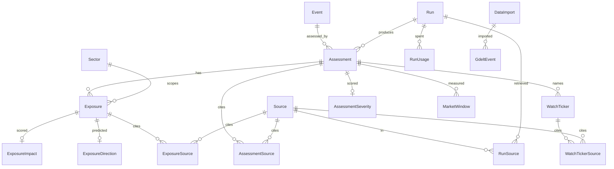

# Database & Data Model

Everything a run concludes is stored in one SQLite database, `data/events.db`.
The full, commented schema is in `schema.sql`. It follows the course
`chinook.db` conventions: **PascalCase singular tables, `<Table>Id` keys, foreign
keys, and ISO-8601 text dates** (string order equals date order).

The database is **tracked in Git** so it ships with the project. `output/`
(HTML + JSON reports) is ignored. The agent can read the database via `read_sql`
but can never write to it; all writes go through `events_db.py`.

## Entities and relationships



Core entities of `data/events.db` and how they link.

## Table reference

| Table | One row per | Notes |
|---|---|---|
| `Sector` | US sector + its SPDR ETF | 11 rows, e.g. `energy`→`XLE` |
| `DataImport` | Imported GDELT file or GPR download | `Sha256` UNIQUE blocks duplicate imports |
| `GdeltEvent` | GDELT export row | Unverified research lead; `EventDate` ≠ `AddedDate` |
| `GprDaily` | Daily GPR index value | Aggregate geopolitical context only; replaced on refresh |
| `Run` | Brief or follow-up | `Kind` ∈ `brief`/`followup`, `AsOf` in `EVENT_TIMEZONE` |
| `Source` | Dated Tavily article | `SourceId` = `s_` + URL hash; only these are citable |
| `RunSource` | Source retrieved by a run | Cited or not |
| `Event` | Tracked development | `EventDate` is the onset date and never changes on follow-up |
| `Assessment` | One run's conclusion about one event | Follow-ups append rows; `UNIQUE(EventId, RunId)` |
| `AssessmentSource` | Citation on an assessment | |
| `Exposure` | Event → channel → sector link | `Status` ∈ `reported_exposure`/`hypothesis` |
| `ExposureSource` | Citation on an exposure | |
| `WatchTicker` | Named exposed stock/ETF | `Rank` 1–3 for top three; benchmarks rejected |
| `WatchTickerSource` | Citation on a ticker | |
| `RunUsage` | Service used by a run | `anthropic` / `jev` / `tavily`; `CostUsd` NULL when unpriced |
| `MarketWindow` | Sector-ETF-vs-SPY return window | Computed in Python on follow-up |

## Jev judgement tables

The optional scorer writes into dedicated tables, each keyed to the assessment or
exposure it judged, so scores never mutate the agent's text:

| Table | Scores | Scale / levels |
|---|---|---|
| `AssessmentSeverity` | Event severity | `Score` 0–3; `Level` minor/moderate/high/severe |
| `ExposureImpact` | Size of effect on a sector | `Score` 0–3; `Level` negligible/small/material/large |
| `ExposureDirection` | Will the sector beat or trail SPY over ~5 sessions? | `Direction` up/down/unclear - a *prediction* scored in `evals/` |

`WatchTicker.JevScore` / `JevLevel` (none/indirect/direct/core) record how
directly each ticker is exposed; the top three by score get `Rank` 1–3.

## Querying

The lead agent reads the database through the `read_sql` tool: **one** `SELECT`/`WITH`
on a read-only connection, at most 50 rows, long cells cut to 300 characters. It
uses this to check whether a story is already tracked. Writes fail at the SQLite
level, not only by prompt.

Direct inspection examples:

```sh
sqlite3 -header data/events.db "SELECT EventId, EventDate, Title FROM Event"
sqlite3 -header data/events.db "
  SELECT e.Title, x.SectorId, x.Status, x.Channel
  FROM Event e JOIN Assessment a USING (EventId) JOIN Exposure x USING (AssessmentId)"
```

## Event tracking

The same real-world story keeps **one `EventId` across days**. When the lead
judges a brief event to be a saved one, it sets `tracked_event_id`; the host
(`brief_run.resolve_tracking`) then checks the ID exists, no two events in a
brief share it, and the onset date is unchanged (an unknown date may be filled
once). `followup EVENT_ID` is the guaranteed link. See
[Architecture & Run Flow](architecture.md) for where this sits in the pipeline.
