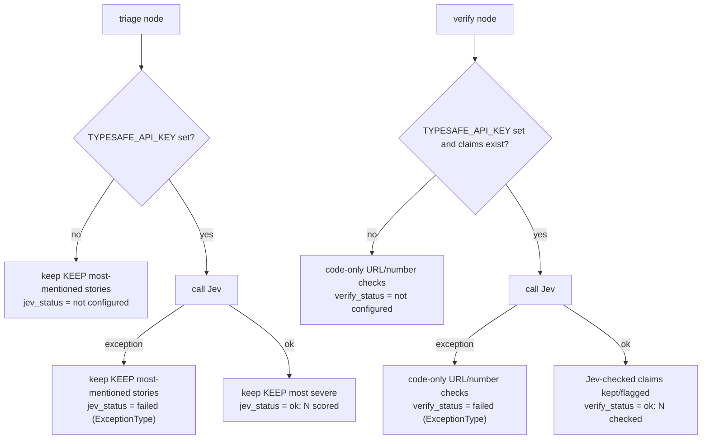

## Overview

The graph is configured entirely through a `.env` file read at process start, plus a handful of
constants baked into the node modules. There is no config file format beyond `.env` and no runtime
flags that change node behavior other than `main.py`'s `--date`/`--thread`/question arguments (see
[Running: CLI and Studio](running-cli-and-studio.md)). This page is the single place listing every
variable and constant, what reads it, and the exact degrade-or-fail behavior when it is absent or
wrong.

## Load order: why it matters

`main.py` calls `load_dotenv(ROOT / ".env")` **before** importing `graph.py`:

```python
ROOT = Path(__file__).resolve().parent
load_dotenv(ROOT / ".env")

from graph import build  # noqa: E402  (after .env, so LangSmith and API keys are set)
```

This ordering is load-bearing, not stylistic. `graph.py` imports `research.py`, which constructs its
chat model clients at **import time**:

```python
MODEL = init_chat_model(os.getenv("RESEARCH_MODEL", "anthropic:claude-sonnet-5-5"), timeout=120, max_tokens=8000)
READER = init_chat_model("anthropic:claude-haiku-4-5-20251001", timeout=60, max_tokens=4000)
```

If `ANTHROPIC_API_KEY` (consumed implicitly by the Anthropic SDK, not read directly by this repo's
code) were not already in the environment when `research.py` is imported, client construction would
be built against a missing credential. Loading `.env` first guarantees the keys exist before any
module-level client is built. LangSmith environment variables (`LANGSMITH_TRACING`,
`LANGSMITH_API_KEY`, `LANGSMITH_PROJECT`) must be present before import for the same reason: tracing
instrumentation activates at import time.

`langgraph dev` (LangGraph Studio) does not go through `main.py`. It reads `langgraph.json`'s `"env"`
key instead:

```json
{
  "dependencies": ["."],
  "graphs": { "event_graph": "./graph.py:graph" },
  "env": ".env"
}
```

The LangGraph CLI loads the same `.env` file before importing `graph.py:graph`, so the two entry
points end up with identical configuration, but through two different loading mechanisms that both
happen to point at the same file. See [Running: CLI and Studio](running-cli-and-studio.md) for the
two entry points in full, and [External Services](../integrations/external-services.md) for what
each key authenticates against.

## Required variables

These stop the run if missing. Because the graph is a LangGraph `StateGraph` with a SQLite
checkpointer (`main.py`) or Studio's own persistence, nodes that already ran before the failure are
already committed to `data/threads.db` (or Studio's store) — a failed run is resumable from the
checkpoint after the key is fixed, not lost.

| Variable | Read by | Required for | Failure mode when missing or invalid |
|---|---|---|---|
| `ANTHROPIC_API_KEY` | Not read directly in this repo's code; consumed implicitly by the Anthropic client inside `init_chat_model` (`research.py`) when it calls the Anthropic API | `research` node's agent (`MODEL`) and its reader subagent (`READER`) | `gdelt`, `triage` run and checkpoint normally. `research` raises when the agent first calls the model (an authentication error from the Anthropic client), stopping the graph mid-run. `verify`, `price`, `output` never run, so no report is written for that invocation. Re-running the same thread after fixing the key resumes from the checkpoint rather than re-doing `gdelt`/`triage` |
| `TAVILY_API_KEY` | `research.py`, read directly via `os.environ["TAVILY_API_KEY"]` inside the `search_news` tool | `research` node's only tool | Since the key is read with `os.environ[...]` (not `.get`), a missing key raises `KeyError` the first time `search_news` is invoked by the agent — i.e., partway through the `research` node, after `gdelt` and `triage` have already checkpointed. An invalid key instead fails inside `TavilyClient.search`, surfacing as an exception from the tool call. Either way the run stops before `verify`/`price`/`output` |

## Optional variables (degrade gracefully)

These are read with `os.getenv(...)` (never raise `KeyError`) and each has an explicit, code-defined
fallback path. None of them stop the graph.

| Variable | Read by | Default / behavior when unset | Behavior when set but the call fails |
|---|---|---|---|
| `TYPESAFE_API_KEY` | `triage.py` (`jev_scores`), `verify.py` (`jev_checks`); implicitly resolved by `TypeSafeClient` from this env var when no `api_key` argument is passed | **triage**: skips Jev entirely, keeps the `KEEP` (3) most-mentioned stories unscored, sets `jev_status = "not configured: kept the most-mentioned stories"`. **verify**: skips Jev entirely, keeps only the code-level URL/number checks, sets `verify_status = "not configured: URLs and numbers checked only"` | Both nodes wrap the Jev call in `try/except Exception`: on any error they fall back to the same "not configured"-shaped behavior but with a `"failed (<ExceptionType>): ..."` status string instead, so a report is still produced and the failure is visible in the Markdown/JSON output and in `data/events.db`'s `run.jev_status`/`run.verify_status` columns |
| `RESEARCH_MODEL` | `research.py`, at import time: `init_chat_model(os.getenv("RESEARCH_MODEL", "anthropic:claude-sonnet-5-5"), ...)` | Defaults to `anthropic:claude-sonnet-5-5` | An invalid model string fails at import time (building `graph.py` fails before any node runs), not at call time — since `MODEL` is a module-level constant |
| `LANGSMITH_TRACING` | Read implicitly by the `langsmith`/`langchain` SDKs, not by this repo's code | When unset or `false`, no traces are sent; the graph runs identically otherwise | N/A — tracing is purely additive observability, never gates node execution |
| `LANGSMITH_API_KEY` | Same (implicit, LangSmith SDK) | Required only if `LANGSMITH_TRACING=true`; if tracing is enabled but the key is missing or wrong, the LangSmith SDK logs/suppresses trace-upload errors without failing the graph | Same: trace upload failures do not propagate into node execution |
| `LANGSMITH_PROJECT` | Same (implicit, LangSmith SDK) | Controls which LangSmith project traces land in; defaults to the SDK's own default project when unset | N/A |

Two variables appear in `.env` but are not read anywhere in this repository's own modules at the
time of writing: `MODEL` and `EVENT_TIMEZONE` (also `STRONG_MODEL`, present in `.env` but likewise
unused). Only `RESEARCH_MODEL` actually selects the research agent's model; `MODEL`/`STRONG_MODEL`
in `.env` have no effect on current code. Treat their presence in `.env`/`.env.example` as
forward-looking or vestigial rather than load-bearing configuration — do not assume setting them
changes behavior without re-checking the source.

## Hardcoded constants (not environment-configurable)

These constants live in source and require a code change — not an env var — to alter. They matter
operationally because they bound cost, recall, and what counts as "severe" or "verified".

| Constant | File | Value | What it controls |
|---|---|---|---|
| `UPDATES` | `gdelt.py` | `24` | Number of 15-minute GKG files joined per window (6 hours of GDELT data) |
| `TOP_STORIES` | `gdelt.py` | `30` | How many ranked stories `gdelt` keeps before triage sees them |
| `MARKET_THEMES` | `gdelt.py` | set of GDELT theme codes (`ECON_OILPRICE`, `ECON_STOCKMARKET`, `ECON_INTEREST_RATES`, `ECON_INFLATION`, `ECON_CENTRALBANK`, `ECON_TRADE_DISPUTE`, `ECON_BANKRUPTCY`, `FUELPRICES`, `ENV_NATURALGAS`, `ENV_OIL`, `ECON_CURRENCY_EXCHANGE_RATE`, `ECON_DEBT`, `ECON_EARNINGSREPORT`) | Which GKG rows are considered "market" stories at all; a story without one of these theme tags is invisible to the pipeline regardless of coverage |
| `KEEP` | `triage.py` | `3` | How many stories triage keeps for research, whether Jev scored them or they were kept unscored by most-mentioned count. There is no minimum severity floor — `KEEP` is a straight top-N cut |
| `RUBRIC` | `triage.py` | 4-level severity scale text (minor/moderate/high/severe) | The wording Jev is given to judge economic severity; changing it changes what scores as "severe" without changing any number |
| `MAX_SEARCHES` | `research.py` | `3` | Searches the research agent may run per story/question before `search_news` refuses further calls ("Search limit reached. Answer with what you have.") |
| `MEMORY_DAYS` | `research.py` | `7` | Width of the recall window `recall()` reads from the LangGraph store (days ending on `as_of`) and shown to the agent as non-citable context |
| excerpt length | `research.py` | `1500` characters (`item.get("content", "")[:1500]`) | How much of each Tavily article the reader subagent and `verify`'s number-matching see; a true claim with details beyond this window is unreachable |
| `recursion_limit` | `research.py` | `20`, passed in the `agent.invoke(..., config={..., "recursion_limit": 20})` call | Caps the agent's internal step count per story; hitting it raises a `GraphRecursionError` inside that one `research_topic` call |
| `SURE`, `DOUBT`, `SECTOR_SURE` | `verify.py` | `0.7`, `0.4`, `0.75` | Jev-probability thresholds: below `DOUBT` on "supported" or "current" removes a claim; below `SURE` keeps it but flags `unverified`; below `SECTOR_SURE` confidence leaves `sector` unset even if Jev named one |
| `SECTORS` | `verify.py` | 11 GICS-like sectors plus `"none"` | The fixed choice set Jev picks from when asked which sector a claim's economic effect belongs to; also defines what `price` can price (see `SECTOR_ETFS`) |
| `SECTOR_ETFS` | `prices.py` | map of each `SECTORS` key (minus `"none"`) to its SPDR ETF ticker (e.g. `energy -> XLE`) | Which ETF `price` downloads for each sector verify assigned; a sector verify can name that has no entry here would `KeyError` in `sector_moves`, but since `SECTORS` and `SECTOR_ETFS` are kept in sync by hand, this is an invariant to preserve when editing either dict |

Changing any of these is a code change with immediate behavioral consequences (cost, recall,
latitude for "severe", or which sectors can ever appear in a report) — review the constant's call
sites listed above before adjusting it.

## Fallback behavior summary (control flow)



In both nodes the "no key" and "key present but call failed" branches converge on the same
code-only behavior and only differ in the status string written into state (and from there into the
Markdown report and `data/events.db`). This means a Jev outage is indistinguishable in the report's
structure from Jev never having been configured — only the `jev_status`/`verify_status` text tells
them apart. See [Event Pipeline](../workflows/event-pipeline.md) for how these statuses surface in
the final report.

## Persistence note (where state lands when a run stops)

`main.py` opens a single SQLite connection shared by `SqliteSaver` (checkpoints) and `SqliteStore`
(the cross-report findings memory), both backed by `data/threads.db`:

```python
with sqlite3.connect(threads, check_same_thread=False) as connection, SqliteStore.from_conn_string(threads) as store:
    saver = SqliteSaver(connection, serde=JsonPlusSerializer(allowed_msgpack_modules=CHECKPOINT_TYPES))
```

Because the graph is a linear chain (`gdelt -> triage -> research -> verify -> price -> output`,
with follow-ups entering at `research`), a required-variable failure during `research` leaves
`stories` and `severe` already checkpointed under the run's `thread_id`. The run can be continued
with `uv run main.py --thread <id> "..."` once the missing/invalid key is fixed, though a follow-up
re-enters at `research` rather than replaying the failed node outright — see
[Running: CLI and Studio](running-cli-and-studio.md) for resuming threads. `langgraph dev` (Studio)
uses its own persistence layer instead of `data/threads.db`, so the same failure there is scoped to
Studio's run store.
