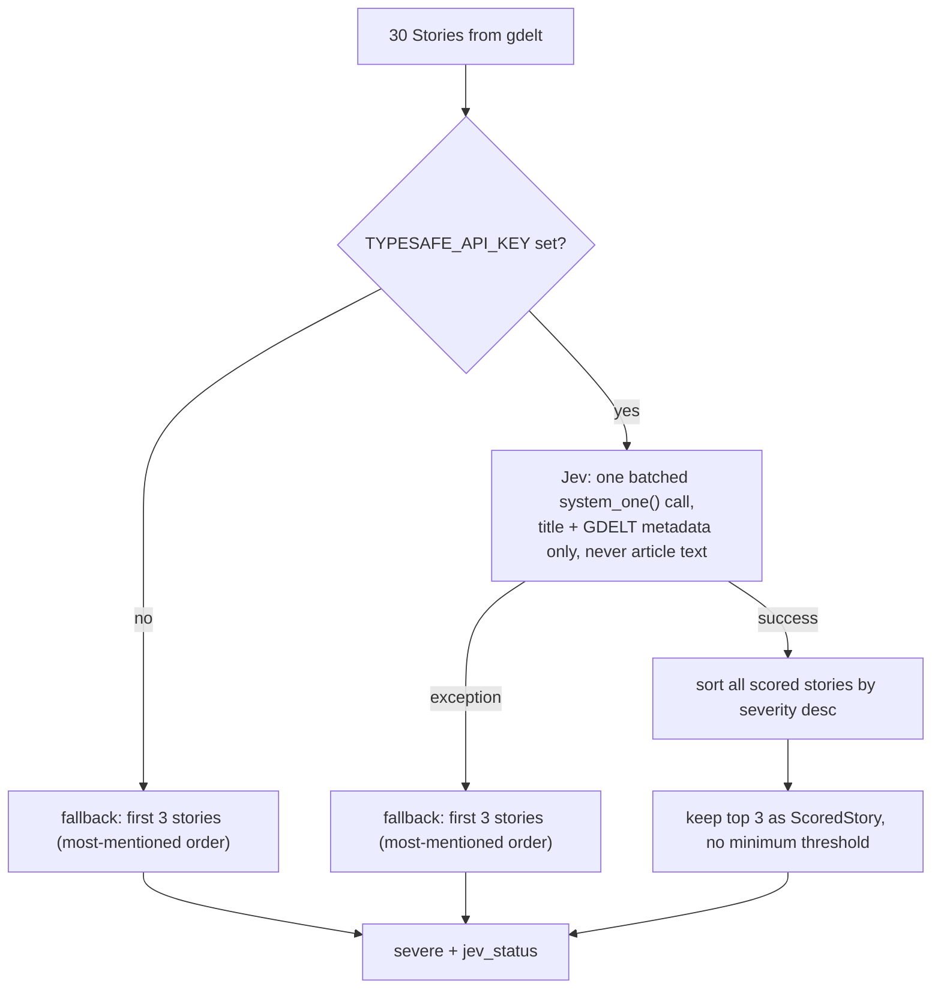

The event pipeline is the start of every new run: it has no LLM involvement in `gdelt.py` at all,
and only one scoring call to Jev in `triage.py`. Together the two nodes turn a firehose of GDELT news
<!-- openwiki: broken internal link [research-and-verification.md] file "research-and-verification.md" does not exist. Fix the href or restore the target, then delete this comment. -->
rows into exactly 3 `ScoredStory` objects that [research](research-and-verification.md) will
investigate. Both nodes are plain functions over [`State`](../architecture/graph-and-state.md)
wired as the first two steps of the graph: `gdelt -> triage -> research -> ...`
(see [graph.py](../../graph.py)).

## `gdelt.py`: download, dedupe, rank

### Entry point and control flow

`gdelt(state)` reads `state.as_of` and writes `as_of` and `stories`. It delegates to
`top_stories(as_of, get, path)`, which opens `data/events.db` ([db.py](../../db.py)) and calls
`market_rows` then `stories`:

<!-- openwiki: mermaid parse failed and this diagram was converted to a text fence so it does not break rendering. Fix the diagram source and restore the mermaid fence. Parser error: Heuristic: an unescaped angle bracket inside a label breaks rendering; rephrase the label. -->
```text
flowchart TD
    A["lastupdate.txt"] --> B["latest 15-min update time"]
    B --> C{"as_of given?"}
    C -->|"no"| D["end = latest"]
    C -->|"yes"| E["end = min(latest, that day 23:45 UTC)"]
    D --> F["24 timestamps, end back to end-5h45m"]
    E --> F
    F --> G["query gkg_file for already-stored timestamps"]
    G --> H["download only the missing files (8-way thread pool)"]
    H --> I["parse rows: keep MARKET_THEMES rows with a PAGE_TITLE"]
    I --> J["INSERT rows + file marker in one transaction"]
    J --> K["SELECT all rows in the window back from events.db"]
    K --> L["group by title -> Story, rank by sites then articles"]
    L --> M["top 30 Stories"]
```

1. **`lastupdate.txt`.** `market_rows` fetches
   `http://data.gdeltproject.org/gdeltv2/lastupdate.txt`, parses its third field as a URL whose last
   path segment starts with `YYYYMMDDHHMMSS`, and treats that as the newest update GDELT has
   published.
2. **The 6-hour window.** `end` is the newest update, unless an `as_of` day is given, in which case
   `end` is the earlier of the newest update and that day's `23:45 UTC` (the last 15-minute file of
   the day) — so a day still in progress falls back to whatever GDELT has reached so far. Passing an
   `as_of` later than GDELT's newest update raises `ValueError` naming the newest update time.
   `UPDATES = 24` fifteen-minute timestamps counting back from `end` make up the window (6 hours).
3. **Download only what's missing.** `gkg_file.at` (the 15-minute timestamp) is the dedup key: the
   node queries which of the 24 timestamps are already present and downloads only the rest, in
   parallel with an 8-worker `ThreadPoolExecutor`. A 404 for a given file (`http_get` returns `None`)
   means GDELT skipped that update; it is recorded with `rows = 0` rather than retried forever. See
   [External Services](../integrations/external-services.md) for the HTTP/auth details of the GDELT
   GKG integration.
4. **Filter and parse rows.** Each downloaded file is a zip holding one tab-separated GKG 2.1 export
   (`unzip`). `record(line)` keeps only lines that (a) have at least one theme in `MARKET_THEMES`
   (`ECON_OILPRICE`, `ECON_STOCKMARKET`, `ECON_INTEREST_RATES`, `ECON_INFLATION`, `ECON_CENTRALBANK`,
   `ECON_TRADE_DISPUTE`, `ECON_BANKRUPTCY`, `FUELPRICES`, `ENV_NATURALGAS`, `ENV_OIL`,
   `ECON_CURRENCY_EXCHANGE_RATE`, `ECON_DEBT`, `ECON_EARNINGSREPORT`) and (b) have a
   `<PAGE_TITLE>` tag in the `EXTRAS` (column 26) field. Each kept row's site, URL, title, matched
   themes, actor names (people + organizations), and places are extracted.
5. **Persist, in one transaction per file.** New rows (`gkg_row`) and the file's own marker
   (`gkg_file`, with its kept-row count) are inserted together so that a crash mid-insert leaves a
   file retryable rather than silently marked "fetched but empty." See
   [Persistence](../architecture/persistence.md) for the full `events.db` schema and the dedup
   invariant that a `record_id` (GDELT's `GKGRECORDID`) is never stored twice even across
   overlapping windows.
6. **Group into stories and rank.** `stories(rows)` reads the window's rows back out of the database
   (not just the newly downloaded ones) and groups them by lower-cased page title into a `Story`:
   article count, distinct site count, the union of actors/themes/places (actors and places each
   capped to a readable few). Stories are ranked by **distinct site count first, then article count,
   then title** (both descending except title), and the **top 30** (`TOP_STORIES`) are kept. Ranking
   by site count rather than raw article count favors stories picked up across independent outlets
   over wire-service reprints hitting one site many times.

### Known limitation: market themes are a loose filter

`MARKET_THEMES` is a GDELT theme-tag filter, not a semantic judgment of economic importance — GDELT
tags an article with a theme like `ECON_STOCKMARKET` or `ECON_TRADE_DISPUTE` based on keyword
co-occurrence, so the 30 stories that reach triage routinely include non-economic stories (celebrity
news that happens to mention a stock, a human-interest piece that mentions a tariff in passing,
etc.). `gdelt.py` does **not** filter these out; it only ranks by coverage breadth. The real filter
for economic relevance and severity is Jev's score in `triage.py`, described below — this pipeline's
design assumes noisy input at the ranking stage and relies entirely on scoring, not on theme
membership, to pick the stories worth researching.

## `triage.py`: Jev scores severity, keeps the 3 most severe

### Entry point and control flow

`triage(state)` reads `state.stories` (the 30 ranked `Story` objects) and writes `severe` (up to 3
`ScoredStory` objects) and `jev_status` (a short human-readable status string also persisted to
`events.db`'s `run.jev_status` column by the output node).



1. **What Jev sees.** `describe(story)` builds, per story, only a `title` and a short `summary`
   string assembled from GDELT metadata — actors, themes, places, article/site counts — explicitly
   **never the article text itself** (the pipeline has not fetched any article bodies yet at this
<!-- openwiki: broken internal link [research-and-verification.md] file "research-and-verification.md" does not exist. Fix the href or restore the target, then delete this comment. -->
   point; that happens later in [research](research-and-verification.md)). The module docstring is
   explicit that this makes Jev's score "rank leads," not a verified fact.
2. **One batched request.** `jev_scores` builds one `Score` question per story (`s0`, `s1`, ...)
   sharing the same four-level `RUBRIC` (0 minor .. 3 severe), and sends all 30 stories' `describe()`
   output plus all 30 questions in a single `TypeSafeClient(timeout=90).system_one(...)` call — not
   one request per story.
3. **Keep the 3 highest, no minimum.** On success, all scored stories are sorted by severity
   descending and the top `KEEP = 3` become `severe`. There is **no minimum severity threshold**:
   the module docstring records that on 30 Sep 2026 the highest of the top 100 stories scored only
   1.07 (on the 0-3 rubric), so requiring at least "moderate" (1.0) or "high" (2.0) would have left
   nothing to research on a quiet news day. The pipeline always researches its 3 highest-ranked
   leads, however unremarkable, rather than researching nothing.
4. **Fallback: most-mentioned, not most-severe.** If `TYPESAFE_API_KEY` is unset, or `jev_scores`
   raises any exception, `triage` falls back to the **first 3 stories in `state.stories`** — i.e.
   the GDELT coverage ranking (most sites, then most articles) rather than a severity ranking — with
   `severity=None` on each. `jev_status` records which case occurred: `"not configured: kept the
   most-mentioned stories"`, or `"failed (<ExceptionType>): kept the most-mentioned stories"` with
   the concrete Python exception type name. See
   [External Services](../integrations/external-services.md) for the Jev/Typesafe request shape and
   its other caller in `verify.py`.

## State shape

`Story` (produced by `gdelt`) and `ScoredStory` (produced by `triage`, a `Story` plus `severity` and
`confidence`) are defined in [state.py](../../state.py) and are part of
`CHECKPOINT_TYPES`, so they can round-trip through a LangGraph checkpoint for a paused or resumed
run. `gdelt` writes `state.as_of` (normalized to the resolved GDELT day even when the caller passed
no `as_of`) and `state.stories`; `triage` writes `state.severe` and `state.jev_status`. Neither node
touches any other state field, consistent with the "each node reads and writes only the fields
marked for it" contract described in
[Graph and State](../architecture/graph-and-state.md).

## Persistence and dedup

All durable state behind this workflow lives in `data/events.db`:

- `gkg_file` / `gkg_row`, written only by `gdelt.py`'s `market_rows`, are the dedup store: a 15-minute
  file is fetched at most once (keyed by `at`), and an article row is stored at most once (keyed by
  GDELT's own `GKGRECORDID`), so a window that overlaps a previous run's window re-downloads nothing.
- `story`, written later by `output.py` once triage has run, records the 3 kept `ScoredStory` rows
  (rank, title, URL, severity — `NULL` when Jev did not score — article/site counts) against the run
  that produced them.

See [Persistence](../architecture/persistence.md) for the full schema, the one-transaction-per-file
invariant that keeps `gkg_file`/`gkg_row` consistent under a crash, and how `run`/`story` tie back to
a specific graph run.

## Testing

`tests/test_nodes.py` stubs the GDELT HTTP layer entirely (no real network calls) via three helpers —
`gkg_row` (builds one raw tab-separated GKG line with only the columns `gdelt.py` reads filled in),
`zipped` (wraps it in an in-memory zip the way GDELT ships files), and `gkg_files` (a fake server
answering `lastupdate.txt` and any `*.gkg.csv.zip` URL, recording every URL requested). Each test
passes its own `tmp_path / "events.db"` so tests never touch the real database. Coverage of this
workflow's load-bearing behaviors includes:

- **Ranking and dedup on repeat calls** — `test_top_stories_rank_market_headlines_by_sites_over_the_last_6_hours`
  asserts stories are ranked by distinct site count, that a non-market theme (`WB_ANIMALS`) is
  excluded, that a 404'd update is tolerated, and that calling `top_stories` again with the same
  window returns identical results without re-downloading.
- **The `--date`/`as_of` window boundary** — `test_top_stories_for_a_day_read_its_last_6_hours`
  checks that an `as_of` day reads the 24 files ending `23:45 UTC` that day; `test_top_stories_for_a_day_gdelt_has_not_reached_says_so`
  checks the `ValueError` for a day beyond GDELT's newest update.
- **The 15-minute overlap** — `test_a_window_15_minutes_later_downloads_only_the_new_file` runs the
  pipeline, advances the simulated "latest update" by one 15-minute step, runs it again, and asserts
  only the single new file is requested while `events.db`'s cumulative file/row counts include both
  runs — the concrete proof of the "download only what's missing" dedup mechanic.
- **Triage's two outcomes** — `test_triage_keeps_the_most_severe` stubs `triage.jev_scores` to return
  deterministic scores and checks the top-3-by-severity selection and ordering;
  `test_triage_without_jev_says_so` clears `TYPESAFE_API_KEY` and checks the fallback keeps the
  input order with `severity=None` and a `jev_status` starting with `"not configured"`.

See [Test Strategy](../testing/test-strategy.md) for the full fixture design (why GDELT tests inject
`get` instead of monkeypatching `httpx`, and how each fixture maps to the specific columns `gdelt.py`
reads) and for how the rest of the graph's nodes are tested the same way.
