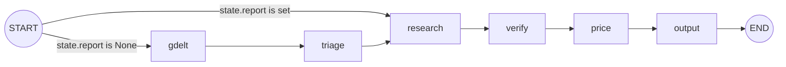

A follow-up question is a second (or later) message sent into a thread that has already produced
one report. Instead of re-fetching GDELT and re-triaging the day's stories, the graph treats the
message itself as the thing to research, then re-runs the same `verify -> price -> output` tail
used by a full run.

## Prerequisite: the thread must be checkpointed in the same `data/threads.db`

A follow-up only works because the graph's full [`State`](../architecture/graph-and-state.md) from
the earlier run is still sitting in a SQLite checkpoint, keyed by `thread_id`, inside
`data/threads.db`. See [Persistence](../architecture/persistence.md) for how `main.py` wires a
`SqliteSaver`/`SqliteStore` pair against that one file. This has a direct, easy-to-miss
consequence: a thread ID printed by one run only continues correctly against **that same**
`data/threads.db` file.

- If you move, delete, or recreate `data/threads.db`, every previously printed thread ID becomes
  unusable — there is no checkpoint left to load, so `--thread ID` has no prior `State` to resume.
- `langgraph dev` (LangGraph Studio) compiles the graph **without** this checkpointer
  (`graph.py`'s module-level `graph = build().compile()`); Studio supplies its own persistence
  instead. A thread ID from a CLI run cannot be continued in Studio, and vice versa — see
  [Running the Pipeline: CLI and LangGraph Studio](../operations/running-cli-and-studio.md) for the
  two entry points and how they diverge.

## Invoking a follow-up from the CLI

```sh
uv run main.py --date 2026-09-30
# ... Thread b630ce9c. Continue it with: uv run main.py --thread b630ce9c "your question"
uv run main.py --thread b630ce9c "Which airlines could be affected by the flydubai incident?"
```

`main.py`'s argument parser requires `--thread` whenever a question is given (`a follow-up question
needs --thread`), since a bare question has no earlier `State` to attach to. Internally, a
follow-up builds a different input shape than a fresh run:

```python
inputs = {"messages": [{"role": "user", "content": args.question}]} if args.question else {"as_of": args.date}
```

Both shapes are passed to `app.stream(inputs, config, ...)` with `config["configurable"]["thread_id"]`
set to the given (or newly generated) thread. When `thread_id` matches an existing checkpoint, the
graph resumes from that thread's last persisted `State` — including the `report` field written by
the earlier run's `output` node — and merges `inputs` into it before `START` runs.

## Routing: `state.report` decides the entry node

`graph.py` defines a conditional edge out of `START`:

```python
def start(state: State) -> str:
    """Follow-up questions skip to research once the thread has a report."""
    return "research" if state.report else "gdelt"
```

`state.report` is `None` until the `output` node of a prior run in this thread has set it to the
written report's path. So the routing decision is not based on whether a question string was
supplied on the command line — it is based entirely on whether the resumed thread's checkpointed
`State` already has a `report`. In practice the two line up (a question always implies `--thread`
against an already-reported thread), but the mechanism itself only inspects state:



A follow-up therefore enters at `research`, skipping `gdelt` (no new GDELT fetch, no change to
`stories`) and `triage` (no new Jev scoring, no change to `severe`). It still runs `research`,
`verify`, `price`, and `output` in full — the same tail a brand-new run goes through after triage.
See [Graph and State](../architecture/graph-and-state.md) for the rest of the graph's wiring and
<!-- openwiki: broken internal link [research-and-verification.md] file "research-and-verification.md" does not exist. Fix the href or restore the target, then delete this comment. -->
[Research and Verification](research-and-verification.md) for what `research` and `verify` do on a
first run.

## What `research` does differently on a follow-up

`research.py`'s `research` node branches on `state.report` the same way `graph.py:start` does:

```python
if state.report:
    earlier = "; ".join(f.topic for f in state.findings)
    topics = [f"Follow-up question: {state.messages[-1].text}\nEarlier findings in this thread: {earlier}"]
else:
    ...
```

Key differences from a new report's research step:

- **One topic, not one per severe story.** A fresh run builds one research topic per entry in
  `state.severe` (up to three, from triage). A follow-up builds exactly **one** topic: the latest
  message's text (`state.messages[-1].text`) combined with a semicolon-joined list of the *topics*
  of this thread's existing `Finding`s (`state.findings`), so the research agent knows what has
  already been investigated in this conversation without being handed the prior claims verbatim.
- **No 7-day memory recall.** A new report calls `recall(runtime.store, as_of)` to pull up to seven
  days of previously stored findings from the LangGraph store as non-citable context (see
  [Persistence](../architecture/persistence.md#the-store-as-findings-memory)). A follow-up skips
  `recall` entirely — the `else` branch that calls it never executes — because the thread's own
  `state.findings` already carries forward what this conversation has found so far; cross-day
  findings memory is a concern of *new* reports only, not of continuing one conversation.
- **Still one agent run, same tool and limits.** The single topic still goes through
  `research_topic`, the same `create_agent` loop with `search_news` (at most `MAX_SEARCHES = 3`
  searches, articles restricted to the 7 days ending on `as_of`) used for ordinary stories. The
  follow-up's `as_of` is unchanged from the thread's original run (there is no `--date` on a
  follow-up invocation), so searches stay anchored to the original run's as-of day, not "today".

### Findings, sources, rejected, and moves are fully replaced

`research` returns `{"findings": findings, "sources": list(sources.values())}` where `findings` is
a **new** one-element list (just the follow-up's `Finding`) and `sources` is the set of articles
*this* research call returned. Because `State.findings` and `State.sources` have no custom reducer
(unlike `messages`, which uses `add_messages` to append), LangGraph's default behavior for a node's
returned field is to **overwrite** it, not merge it. So after a follow-up's `research` step:

- `state.findings` becomes just the one new `Finding` for the follow-up question — the previous
  findings are gone from state (their *topics* were folded into the new topic string first, but the
  old `Finding` objects, including their claims, are not kept in `state.findings`).
- `state.sources` becomes just the articles the follow-up's `search_news` calls returned.
- `verify` then re-runs over this new `findings`/`sources` pair and replaces `state.rejected` with
  whatever it rejects this time (the earlier run's `rejected` lines do not carry over).
- `price` likewise replaces `state.moves` with the sector price moves it computes for the new,
  single finding's kept claims.

This means a follow-up's checkpointed `State` no longer describes the thread's original stories at
all — it describes only the latest question and its own findings/sources/rejections/moves. The
earlier `Finding`s' *topics* survive only as a string folded into the one new research prompt, not
as structured state.

## `severe` and `jev_status` persist unchanged, and are omitted from the report

`graph.py`'s conditional edge sends a follow-up straight to `research`, bypassing `gdelt` and
`triage` entirely, so neither node runs and neither writes its fields. `state.severe` (the triaged
stories) and `state.jev_status` (Jev's triage status line) are therefore left exactly as the
original run's `triage` step set them — they are not cleared, re-scored, or touched in any way by a
follow-up.

`output.py`'s `markdown()` function, however, only reads and prints `severe`/`jev_status` when the
run is **not** a follow-up:

```python
followup = state.report is not None
...
if not followup:
    lines += [f"Triage: Jev {state.jev_status}. Severity is 0 minor .. 3 severe, judged from GDELT data only.", ""]
```

So even though `state.severe` and `state.jev_status` are still sitting in the checkpointed `State`
(stale, from the original run), a follow-up's rendered report omits the triage section entirely and
titles itself `# Follow-up as of <as_of>` instead of `# Events as of <as_of>`. The same `followup`
flag also:

- skips writing `story` rows to `data/events.db` in `output.py:log` (a follow-up's `run` row is
  recorded with `kind = "followup"`, but no new `story` rows are inserted, since `state.severe`
  describes the original run's stories, not anything new);
- skips `remember(runtime.store, state.as_of, name, state.findings)` — a follow-up's one-off finding
  is not written into the 7-day findings-memory store, since that store is meant for day-over-day
  report continuity, not the back-and-forth within one thread's own `state.findings`.

## Summary of what a follow-up reuses vs. replaces

| Field | Follow-up behavior |
|---|---|
| `as_of` | Unchanged, carried over from the thread's original run |
| `stories` | Unchanged (not refetched; `gdelt` does not run) |
| `severe`, `jev_status` | Unchanged (not re-triaged; `triage` does not run); omitted from the rendered report |
| `messages` | Appended: the new question, then the new reply (`add_messages` reducer) |
| `findings` | Replaced with a single new `Finding` for the follow-up question |
| `sources` | Replaced with the articles this follow-up's searches returned |
| `rejected` | Replaced by this run's `verify` step |
| `moves`, `price_window` | Replaced by this run's `price` step |
| `report` | Overwritten with the new report's path |

For the first-run behavior this table is contrasted against — how `severe`, `findings`, `rejected`,
and `moves` are produced the first time through — see
<!-- openwiki: broken internal link [research-and-verification.md] file "research-and-verification.md" does not exist. Fix the href or restore the target, then delete this comment. -->
[Research and Verification](research-and-verification.md).
