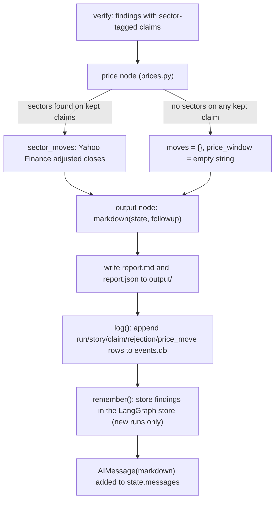

The last two nodes of the graph, `price` (`prices.py`) and `output` (`output.py`), turn verified
claims into a market-reaction number and then into the artifact the user actually sees: a Markdown
report, a matching JSON file, a row set in `data/events.db`, and the chat reply itself. Both nodes
are plain Python — no LLM call, no external judgment service — so their behavior is deterministic
given the state `verify` and `research` produced.


*Control flow from a verified `State` through pricing, report assembly, persistence, and the chat reply.*

## `price`: sector ETF moves vs. SPY

`prices.py:price` reads `state.findings` and `state.as_of` and writes `state.moves` and
<!-- openwiki: broken internal link [research-and-verification.md] file "research-and-verification.md" does not exist. Fix the href or restore the target, then delete this comment. -->
`state.price_window`. It only looks at the `sector` field [`verify`](research-and-verification.md)
attached to kept claims — a claim with no sector (because Jev was not confident enough, or Jev was
not configured) never contributes a sector to price.

```python
sectors = sorted({c.sector for f in state.findings for c in f.claims if c.sector})
if not sectors:
    return {"moves": {}, "price_window": ""}
moves, window = sector_moves(sectors, date.fromisoformat(state.as_of))
```

If no kept claim has a sector, `price` skips Yahoo Finance entirely and returns empty moves with an
**empty** `price_window` string — this is the "nothing to report" case, distinct from the "we tried
and failed" case below, which always leaves an explanatory sentence in `price_window`.

### `sector_moves`: one SPDR ETF per sector, benchmarked against SPY

Each of the eleven US stock-market sectors `verify.py` can tag a claim with maps to its SPDR sector
ETF via the fixed `SECTOR_ETFS` dict (e.g. `energy -> XLE`, `financials -> XLF`,
`information_technology -> XLK`, `real_estate -> XLRE`). `sector_moves(sectors, as_of, download=yahoo_close)`:

1. Builds the symbol set: one ETF per distinct sector found, plus `SPY` always added as the
   benchmark.
2. Downloads adjusted daily closes for a 10-day window before `as_of`, with the end date set to
   `min(as_of + 1 day, today)` — **today's own session is excluded** because it may still be open
   and would make the "last close" comparison meaningless; the window is wide enough to tolerate
   weekends and holidays with no trading.
3. Drops rows that are entirely `NaN`, then compares **the last two remaining closed sessions**:
   `move % = close[-1] / close[-2] - 1` for each ETF, and `vs SPY pts = move%(ETF) - move%(SPY)`.
4. Returns `{sector: (move_pct, vs_spy_pts)}` (both plain Python `float`, since the checkpoint
   cannot serialize numpy scalars) and a `price_window` sentence naming the two exact dates
   compared, e.g. `"Close 29 Sep to close 30 Sep, Yahoo Finance adjusted prices. Observed moves,
   not proof that the news caused them."`

A sector whose ETF has no usable close in the window (e.g. `NaN` on both remaining rows) is simply
left out of `moves` rather than raising.

### Fallback: three ways pricing can come up empty

`sector_moves` never raises out of `price`; every failure path returns `({}, explanation)` instead:

| Condition | Result |
|---|---|
| No sector on any kept claim | `price` short-circuits before calling `sector_moves`; `moves={}`, `price_window=""` |
| `download(...)` (i.e. `yf.download`) raises any exception | `moves={}`, `price_window="Prices unavailable: <ExceptionType>."` |
| `"SPY"` missing from the downloaded columns, or fewer than 2 non-empty rows remain | `moves={}`, `price_window="Prices unavailable: not enough closed sessions."` |

<!-- openwiki: broken internal link [research-and-verification.md] file "research-and-verification.md" does not exist. Fix the href or restore the target, then delete this comment. -->
This matters operationally: a degraded [`verify`](research-and-verification.md) step (no
`TYPESAFE_API_KEY`, so no claim ever gets a sector) and a Yahoo Finance outage look different in the
report text, but both leave `state.moves` empty — see
[External Services](../integrations/external-services.md) for the full integration-level failure
matrix.

**Explicit limitation.** Both `prices.py`'s module docstring and every generated `price_window`
string state it plainly: these are **observed correlations between a day's news and a sector ETF's
next move**, never a claim of causation. The report never asserts that a story caused a price move
— it only juxtaposes the two, and says so in the text shown to the reader.

## `output`: assembling and shipping the report

`output.py:output(state, config, runtime)` is the graph's terminal node. It does four things, in
order: render Markdown, write both files, log to `events.db`, and (new runs only) remember findings
for later recall.

```python
followup = state.report is not None
text = markdown(state, followup)
...
path.write_text(text, encoding="utf-8")                 # output/<as_of>-<thread>-<HHMMSS>.md
path.with_suffix(".json").write_text(json.dumps(data))  # same name, .json
log(name, thread, state, followup)
if runtime.store is not None and not followup:
    remember(runtime.store, state.as_of, name, state.findings)
return {"report": str(path), "messages": [AIMessage(text)]}
```

`followup` is derived the same way the graph's own routing derives it (`graph.py:start`): a thread
whose `State.report` is already set is continuing, not starting fresh — see
[Continuing a Thread with a Follow-up Question](follow-up-questions.md). The run's file name,
`{as_of}-{thread}-{HHMMSS}`, doubles as the `run_id` primary key in `events.db`'s `run` table and as
both files' base name under `output/`.

### The JSON file

`state.model_dump(mode="json", include={...})` serializes exactly the fields a reader of the run
needs to reconstruct it programmatically: `as_of`, `jev_status`, `severe`, `findings`, `rejected`,
`verify_status`, `moves`, `price_window` — notably *not* `messages`, `stories`, or `sources`, which
are either redundant with `findings`/`report` or internal working state.

### The Markdown structure (`output.py:markdown`)

`markdown(state, followup)` builds the same report returned as the chat reply and written to disk.
Its shape differs between a new report and a follow-up:

1. **Header.** `# Events as of <as_of>` or `# Follow-up as of <as_of>`.
2. **Triage line** (new runs only): `Triage: Jev <jev_status>. Severity is 0 minor .. 3 severe,
   judged from GDELT data only.` Omitted entirely on a follow-up, since a follow-up never re-runs
   `gdelt`/`triage`.
3. **Verify line** (always): `Verify: <verify_status>.`
4. **One section per finding**, numbered `## 1. <topic>`, `## 2. <topic>`, ...:
   - On a new run only, and only for the findings that correspond to a triaged story
     (`i < len(state.severe)`), a line with **Jev severity** (`"<score>:.2f of 3"` or
     `"not scored"` when Jev did not run) and **GDELT counts** — article count, site count, and the
     lead URL — taken from the matching `ScoredStory` in `state.severe`. A follow-up's single
     finding (the researched question) has no matching `ScoredStory`, so this line is skipped for
     it regardless of index.
   - The finding's summary paragraph.
   - One bullet per kept claim: the claim text, a Markdown link to its source and the source date,
     and, inline, `Sector: <sector>.` when `verify` assigned one, and
     `Unverified: Jev was unsure the source supports it for this week.` when `claim.unverified` is
     true. Both suffixes are omitted when not applicable, so a fully-verified, sector-tagged claim
     reads differently from an unverified or sectorless one at a glance.
5. **Market reaction** section, present whenever `state.price_window` is non-empty (i.e. pricing was
   attempted at all, successfully or not): a Markdown table of `Sector | ETF | Move | vs SPY` rows
   — one per entry in `state.moves`, each ETF symbol looked up from the same `SECTOR_ETFS` dict
   `prices.py` uses — followed by the `price_window` sentence itself (which is how the "no prices
   because X" fallback text reaches the reader even when the table above it is empty or missing).
6. **Removed by verify** section, present whenever `state.rejected` is non-empty: one bullet per
   rejection line verify produced, each already carrying its own reason
<!-- openwiki: broken internal link [research-and-verification.md] file "research-and-verification.md" does not exist. Fix the href or restore the target, then delete this comment. -->
   (see [Research and Verification](research-and-verification.md)).

The **follow-up variant** is produced by the exact same function with `followup=True`: it keeps the
verify line, the findings (with claims, sources, sectors, unverified flags), the market-reaction
table, and the removed-claims section, but omits the triage line and every per-finding Jev
severity/GDELT-count line, since a follow-up never triages new stories — it only researches,
verifies, and (re)prices the question just asked.

### Logging to `events.db` (`output.py:log`)

`log(run_id, thread_id, state, followup)` opens one connection and, **in a single transaction**,
appends rows across five tables defined in `db.py` (see
[Persistence](../architecture/persistence.md) for the full schema):

- one `run` row (`run_id`, `thread_id`, `as_of`, `kind` = `"events"` or `"followup"`, `jev_status`,
  `verify_status`, `price_window`);
- `story` rows — **new reports only** — one per entry in `state.severe`, with its rank, title, URL,
  Jev severity (`NULL` if unscored), and GDELT article/site counts;
- `claim` rows for every claim kept across every finding, keyed by `(run_id, text)`, carrying its
  source URL, source date, assigned sector, and `unverified` flag;
- `rejection` rows, one per line in `state.rejected`;
- `price_move` rows, one per sector in `state.moves`, with its move% and vs-SPY points.

Every insert uses `INSERT ... ON CONFLICT DO NOTHING` against each table's natural key, so logging a
run is idempotent: re-running the same `output` call (e.g. after a crash) never duplicates or
overwrites rows. `story` rows are deliberately skipped on a follow-up, because a follow-up's
`state.severe` is whatever the thread's original new-report run triaged — re-logging it under the
follow-up's own `run_id` would misattribute those stories to the wrong run.

### Remembering findings for later recall

After logging, `output` calls `research.remember(runtime.store, state.as_of, name, state.findings)`
— but **only when `runtime.store is not None` and the run is not a follow-up**. This stores each
finding that still has at least one kept claim under the LangGraph store's `("findings", as_of)`
namespace, keyed by `f"{run_id}-{i}"`, as `{topic, summary, claims: [text, ...]}`. A later new
report's `research` node calls `research.recall` to show the agent the last `MEMORY_DAYS` (7) days
of these stored findings as non-citable context — see
<!-- openwiki: broken internal link [research-and-verification.md] file "research-and-verification.md" does not exist. Fix the href or restore the target, then delete this comment. -->
[Research and Verification](research-and-verification.md). Follow-ups are excluded from `remember`
so that a thread's back-and-forth questions never pollute the memory other threads' new reports
recall from; only triaged, dated news reports feed that memory.

### The reply

The function's return value, `{"report": str(path), "messages": [AIMessage(text)]}`, is merged into
`state` by LangGraph: `report` is what makes the *next* message on the same thread a follow-up
(`graph.py:start` branches on `state.report is not None`), and the `AIMessage` is what the CLI
(`main.py`) or LangGraph Studio ultimately prints back to the user — the Markdown report **is** the
chat reply, not a separate summary of it.

## Where this fits in the graph

`price` and `output` are the last two edges in `graph.py:build`'s fixed chain
(`gdelt -> triage -> research -> verify -> price -> output`), run on every invocation regardless of
whether it entered through `gdelt` (a new report) or skipped straight to `research` (a follow-up) —
see [Continuing a Thread with a Follow-up Question](follow-up-questions.md) for that routing
decision, and [Event Pipeline](event-pipeline.md) for the nodes upstream of `research`.
